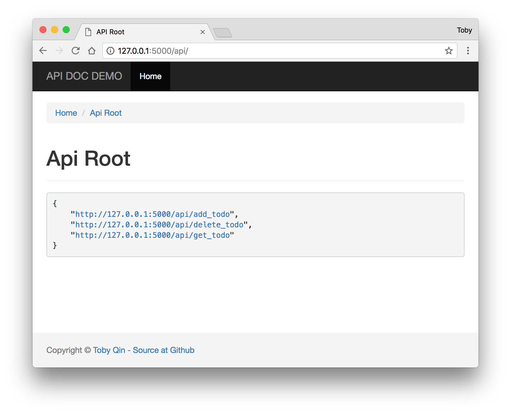
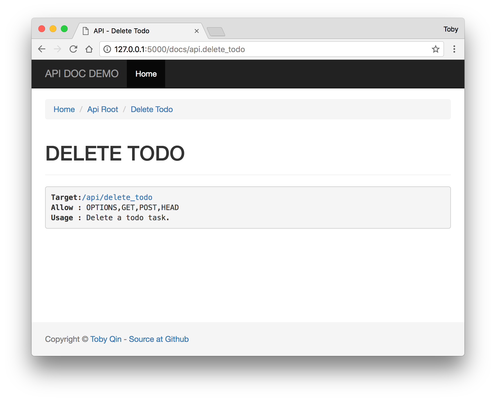
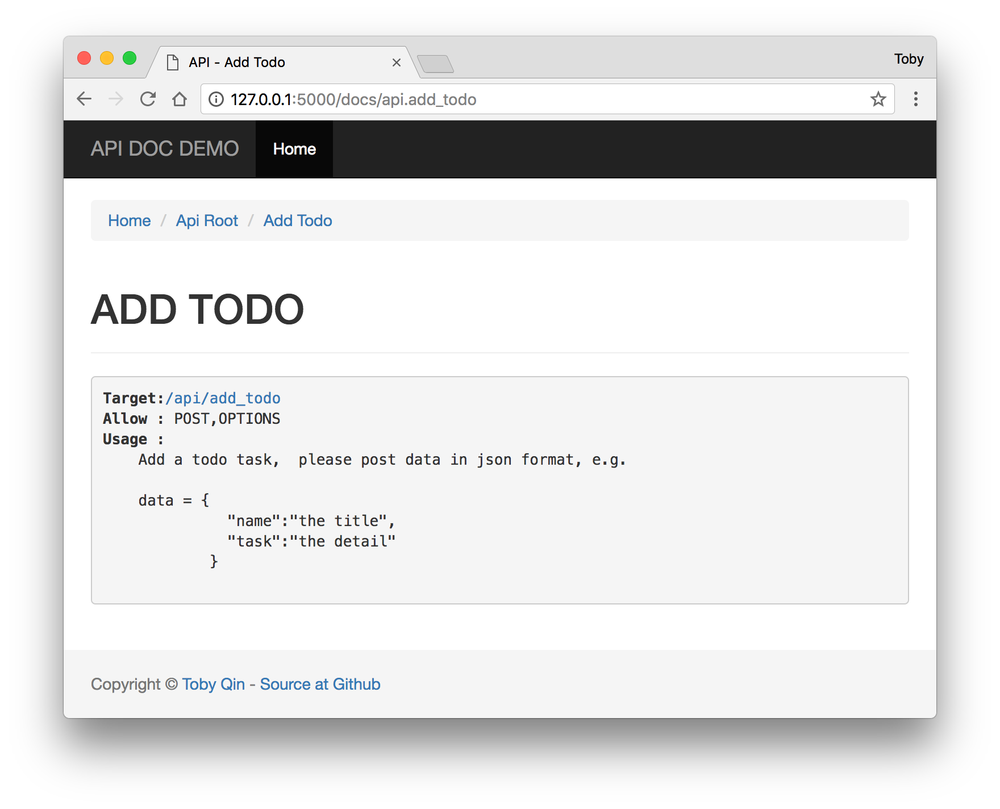

# falsk_api_doc
A demo to auto document Flask api / endpoints.

# Install requirements

You should have python 3.x and pip installed.

```
pip install -r requirements.txt
```

# Run the demo

```
python main.py
```

# How it looks like

Implement the API view in tranditional way, just add function doc to each API method:

```python
api = Blueprint('api', __name__)

@api.route('/get_todo', methods=['GET'])
def get_todo():
    """Get all todo tasks."""
    pass


@api.route('/add_todo', methods=['POST'])
def add_todo():
    """
    Add a todo task,  please post data in json format, e.g.

    data = {
              "name":"the title",
              "task":"the detail"
            }
    """
    pass

@api.route('/delete_todo', methods=['GET', 'POST'])
def delete_todo():
    """Delete a todo task."""
    pass
```

The all APIs will be auto document like this:



If the document just one line, it will be look pretty simple.



A better document can be richer if your function doc contains more information.

